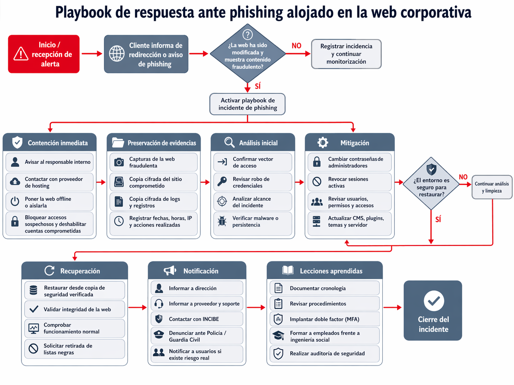

# Phishing Incident Response Playbook

Proyecto práctico de ciberseguridad defensiva centrado en la gestión y respuesta ante un incidente de phishing.

## Objetivo

Diseñar un procedimiento estructurado para responder ante un posible incidente de phishing, desde la detección inicial hasta la recuperación y documentación final.

## Fases del proceso

1. Detección e identificación
2. Análisis del incidente
3. Contención
4. Erradicación
5. Recuperación
6. Documentación y lecciones aprendidas

## Contenido

- Diagrama del playbook
- Documentación del procedimiento
- Resolución del escenario planteado

## Competencias trabajadas

- Incident Response
- Análisis de phishing
- Gestión de incidentes
- Procedimientos SOC
- Documentación técnica
- Contención y recuperación

## Diagrama

## Autor

Samuel Romero De los Reyes